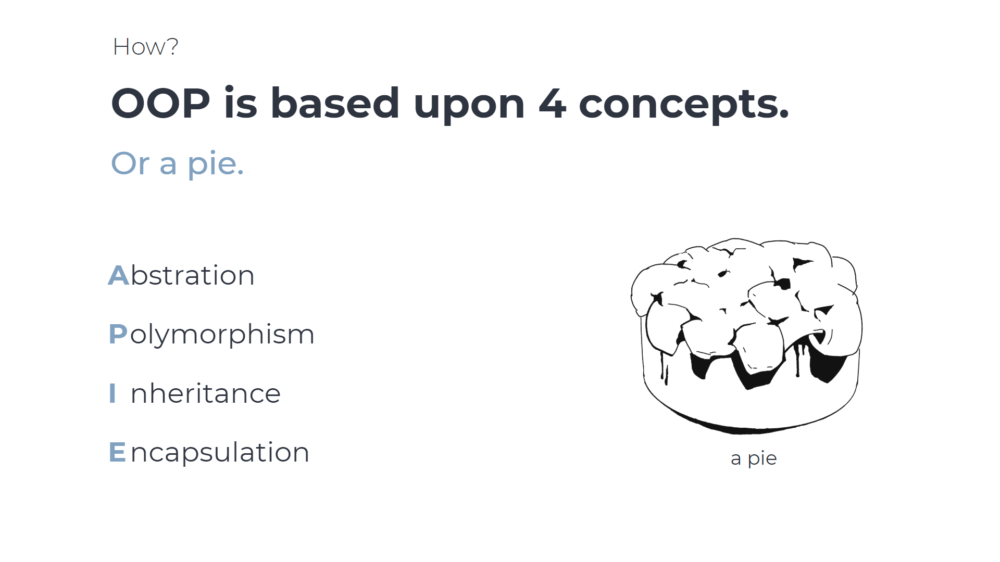
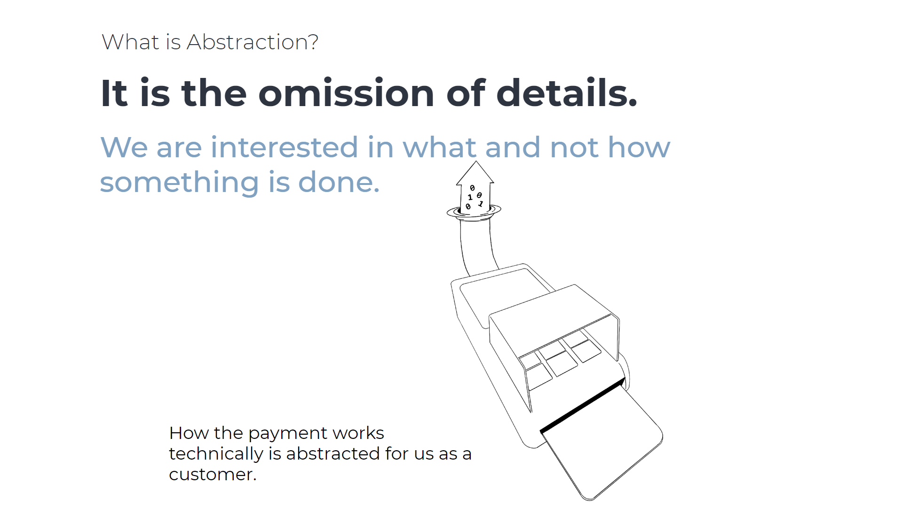
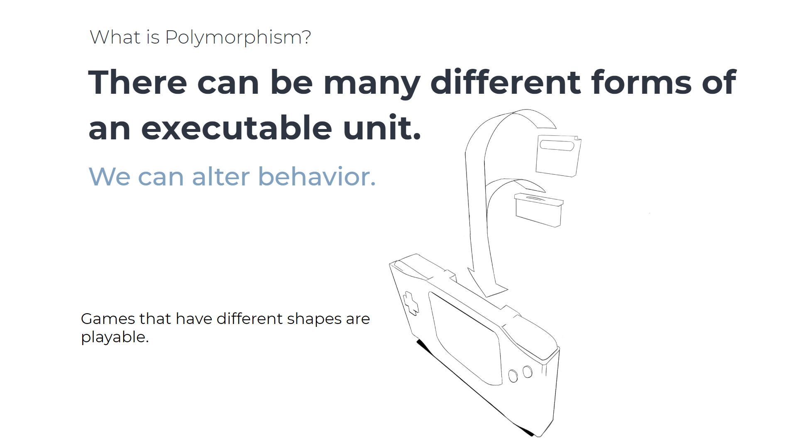
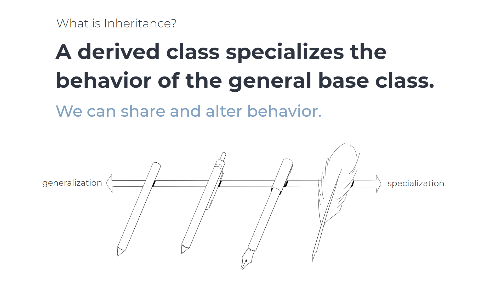
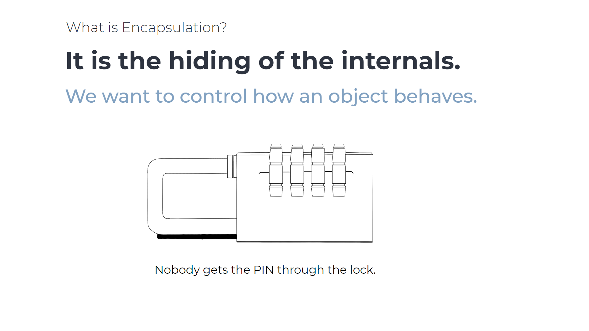

This presentation shows the 4 pillars of object-oriented programming with visual and code examples.

The whole presentation can be found under [`./object-oriented-programming.pdf`](object-oriented-programming.pdf).

# The Key Slides

-----------

-----------

-----------

-----------

-----------
